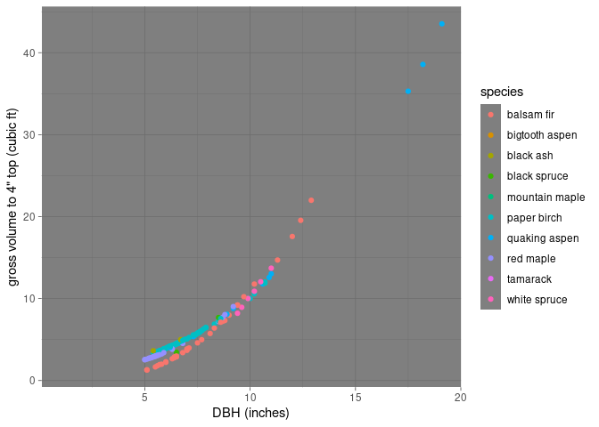
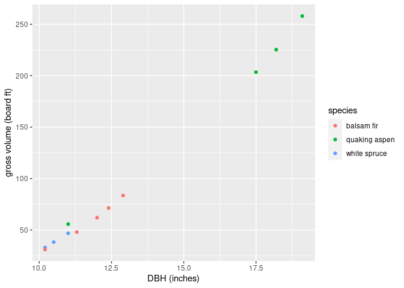
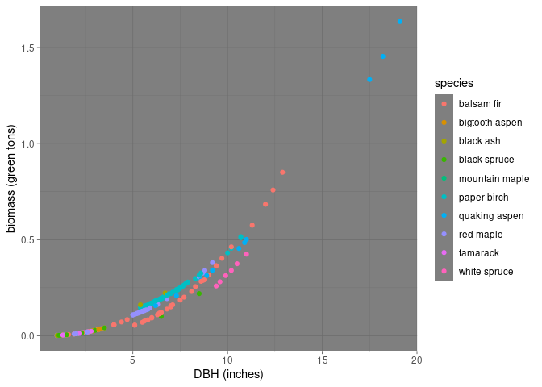

<!-- README.md is generated from README.Rmd. Please edit that file -->

# rpnc250

<!-- badges: start -->

<!-- badges: end -->

The goal of rpnc250 is to provide R functions that produce height,
volume, and biomass estimates using the equations and coefficients from
USFS Research Paper NC-250: Tree volume and biomass equations for the
Lake States.

Hahn, Jerold T. 1984. Tree volume and biomass equations for the Lake
States. Research Paper NC-250. St. Paul, MN: U.S. Dept. of Agriculture,
Forest Service, North Central Forest Experiment Station

The original publication can be accessed from the
[USFS](https://www.fs.usda.gov/treesearch/pubs/10037).

## Installation

You can install the released version of rpnc250 from Github with:

``` r
remotes::install_github("SilviaTerra/rpnc250")
```

## Example

Here are some examples to show a few ways to work with the functions:

First, load a few packages.

``` r
library(rpnc250)
library(magrittr)
```

The package has a set of test trees pulled from some FIA data in
northern Minnesota ([source code](data-raw/test_trees.R)).

``` r
tibble::glimpse(test_trees)
#> Rows: 313
#> Columns: 9
#> $ cn          <chr> "65340991010661", "65340995010661", "65340999010661", "65…
#> $ plt_cn      <chr> "65340894010661", "65340894010661", "65340894010661", "65…
#> $ statuscd    <int> 1, 1, 1, 1, 1, 1, 1, 1, 1, 1, 1, 1, 1, 1, 1, 1, 1, 1, 1, …
#> $ spcd        <dbl> 95, 95, 95, 95, 95, 95, 95, 71, 95, 95, 95, 95, 95, 95, 7…
#> $ common_name <chr> "black spruce", "black spruce", "black spruce", "black sp…
#> $ dbh         <dbl> 1.5, 1.5, 2.8, 1.9, 2.7, 2.0, 2.0, 2.6, 3.1, 1.5, 1.5, 2.…
#> $ tpa_unadj   <dbl> 74.965282, 74.965282, 74.965282, 74.965282, 74.965282, 74…
#> $ ht          <int> NA, NA, NA, NA, NA, NA, NA, NA, NA, NA, NA, NA, NA, NA, N…
#> $ volcfgrs    <dbl> NA, NA, NA, NA, NA, NA, NA, NA, NA, NA, NA, NA, NA, NA, N…
```

The height equation includes stand basal area as a covariate, so we can
summarize FIA plot-level (four subplots combined) basal area to use for
that purpose.

``` r
# summarize plot-level basal area
plot_ba <- test_trees %>%
  dplyr::filter(
    !is.na(dbh),
    !is.na(tpa_unadj),
    statuscd == 1
  ) %>%
  dplyr::group_by(
    plt_cn # FIA plot IDs
  ) %>%
  dplyr::summarize(
    bapa = sum(tpa_unadj * 0.005454 * dbh^2),
    .groups = "drop"
  )
```

### Cubic feet

We can summarize total merchantable volume up to 4" top very easily.
First we can join the plot-level basal area table to the tree table,
then we can estimate height to 4" top for each stem, and finally we can
estimate stem-level volumes.

``` r
merch_cuft_4 <- test_trees %>%
  dplyr::filter(
    !is.na(dbh),
    statuscd == 1, # only live trees
    !is.na(tpa_unadj)
  ) %>%
  dplyr::left_join(
    plot_ba,
    by = "plt_cn"
  ) %>%
  dplyr::mutate(
    height_4 = estimate_height(
      spcd = spcd,
      dbh = dbh,
      site_index = 65,
      top_dob = 4,
      stand_basal_area = bapa
    ),
    gross_cuft_vol = estimate_volume(
      spcd = spcd,
      dbh = dbh,
      height = height_4,
      vol_type = "cuft"
    )
  )

merch_cuft_4 %>%
  ggplot2::ggplot(
    ggplot2::aes(x = dbh, y = gross_cuft_vol, color = common_name)
  ) +
  ggplot2::geom_point() +
  ggplot2::labs(
    x = "DBH (inches)",
    y = "gross volume to 4\" top (cubic ft)",
    color = "species"
  )
#> Warning: Removed 106 rows containing missing values (geom_point).
```



### Board feet

To get merchantable volume in board feet (Int’l 1/4) we can set the
merchantable height to 9" for softwood trees, and 10" for hardwood
trees.

``` r
# make table of spcd and hardwood/softwood assignment
spp_groups <- tidyFIA::ref_tables[["species"]] %>%
  dplyr::transmute(
    spcd,
    class = dplyr::case_when(
      major_spgrpcd %in% c(1, 2) ~ "softwood",
      major_spgrpcd %in% c(3, 4) ~ "hardwood"
    )
  )

merch_bdft <- test_trees %>%
  dplyr::filter(
    !is.na(dbh),
    statuscd == 1, # only live trees
    !is.na(tpa_unadj)
  ) %>%
  dplyr::left_join(
    plot_ba,
    by = "plt_cn"
  ) %>%
  dplyr::left_join(
    spp_groups,
    by = "spcd"
  ) %>%
  dplyr::mutate(
    top_dob = dplyr::case_when(
      class == "hardwood" ~ 10,
      class == "softwood" ~ 9
    )
  ) %>%
  dplyr::filter(
    dbh >= top_dob + 1 # make sure dbh is at least as big as top dob
  ) %>%
  dplyr::mutate(
    merch_height = estimate_height(
      spcd = spcd,
      dbh = dbh,
      site_index = 65,
      top_dob = top_dob,
      stand_basal_area = bapa
    ),
    gross_bdft_vol = estimate_volume(
      spcd = spcd,
      dbh = dbh,
      height = merch_height,
      vol_type = "bdft"
    )
  )

merch_bdft %>%
  ggplot2::ggplot(
    ggplot2::aes(x = dbh, y = gross_bdft_vol, color = common_name)
  ) +
  ggplot2::geom_point() +
  ggplot2::labs(
    x = "DBH (inches)",
    y = "gross volume to 9/10\" top (board ft)",
    color = "species"
  )
```



### Biomass

``` r
trees_with_biomass <- test_trees %>%
  dplyr::filter(!is.na(dbh)) %>%
  dplyr::mutate(
    biomass = estimate_biomass(
      spcd = spcd,
      dbh = dbh,
      site_index = 65,
      stand_basal_area = 75
    )
  )

trees_with_biomass %>%
  ggplot2::ggplot(
    ggplot2::aes(x = dbh, y = biomass, color = common_name)
  ) +
  ggplot2::geom_point()
```


